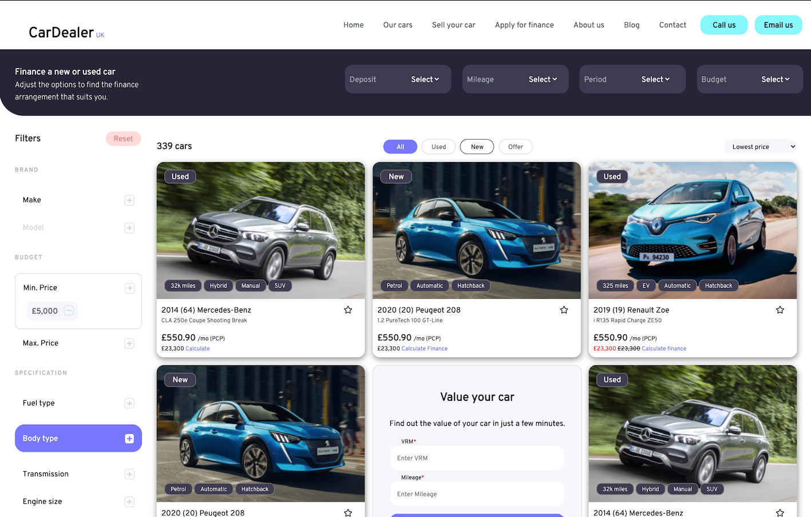

## Nexus Point tech assignment - Daniel Horne

I was asked to take a design on Figma, and apply this to code.

This can be viewed on the following link: https://horne-d.github.io/car_dealer/

The code is now fully responsive, scaling down from Desktop, to iPad and finally to a mobile device.

### Desktop

### iPad

### Mobile

